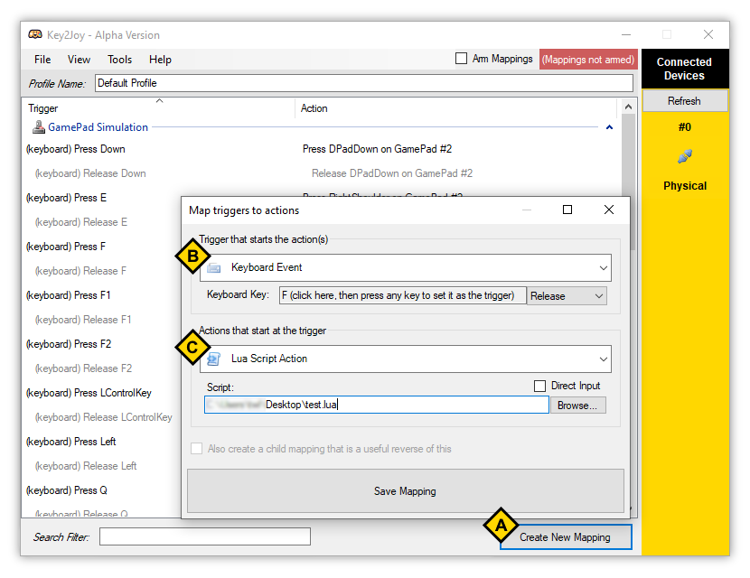
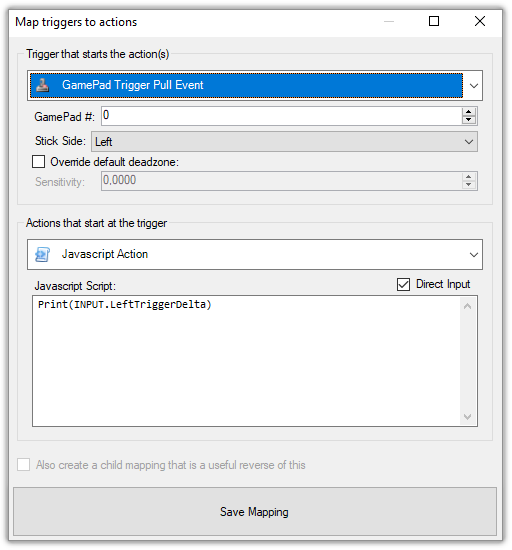
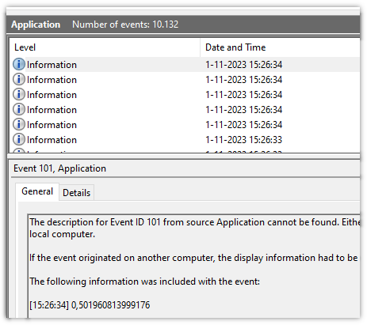

#  Key2Joy - Scripting
Using action scripts you can bind a complex sequence of actions to a
trigger.

Most actions that you can configure in Key2Joy are available through
scripting. To get started check out the examples, or browse the full API
Reference.

* [📃 Scripting API Reference](Index.md)


## Available Scripting Languages
When writing action scripts you have the choice to use any of these
languages:
* [Lua 5.2.3](https://www.lua.org/manual/5.2/)
* [ECMAScript 5.1 (Javascript)](https://262.ecma-international.org/5.1/)
  *(with partial [ECMAScript 2015 - 2022
  Support](https://github.com/sebastienros/jint#version-3x))*

*If you're an advanced user and curious about the Lua and Javascript
implementations: this project uses [NLua](https://github.com/NLua/NLua) and
[Jint](https://github.com/sebastienros/jint).*


## How to trigger a script

**Goal:** When the users presses "F" on the keyboard, simulate pressing → ↓
← B on the GamePad.

1. Save this script to your desktop as `test.lua`:
    ```lua
    SetDelayedFunctions(
       250, -- The following functions run with 250ms delay between them
       function ()
          -- You can press and hold...
          GamePad.Simulate(GamePadControl.DPadRight, PressState.Press)
       end,
       function ()
          -- ... to later release a button.
          GamePad.Simulate(GamePadControl.DPadRight, PressState.Release)
       end,
       function ()
          GamePad.Simulate(GamePadControl.DPadDown, PressState.Press)
       end,
       function ()
          GamePad.Simulate(GamePadControl.DPadDown, PressState.Release)
       end,
       function ()
          GamePad.Simulate(GamePadControl.DPadLeft, PressState.Press)
       end,
       function ()
          GamePad.Simulate(GamePadControl.DPadLeft, PressState.Release)
       end,
       function ()
          GamePad.Simulate(GamePadControl.B, PressState.Press)
       end,
       function ()
          GamePad.Simulate(GamePadControl.B, PressState.Release)
       end
    )
    ```


2. In Key2Joy click **Create New Mapping** *(Button marked A in the screenshot)*
3. Choose the trigger **Keyboard Event** *(Section B in the screenshot)*
4. Click the marked area and press the "F"-key on your keyboard
5. Select **Release** from the dropdown. This ensures the script will only run
   once when the F-key is released.
6. For the action we'll choose: **Lua Script Action** *(Section C in the
   screenshot)*
7. Uncheck **Direct Input** so we can select the `test.lua` script we created
   earlier.
8. Click **Browse**, navigate to the `test.lua` file and select it.
9. Save the mapping.

Now when you enable the mappings *(Check the `Arm Mappings` checkbox in the top right of
Key2Joy)* you can run that Lua script by pressing and releasing the F-key
on your keyboard.

## Some Script Examples
You can find more examples in the [📃 Scripting API Reference](Index.md).

### Holds "A" for 500 ms then stop listening for triggers

**Lua:**
```lua
Print("test")

GamePad.Simulate(GamePadControl.A, PressState.Press)
SetTimeout(function ()
   GamePad.Simulate(GamePadControl.A, PressState.Release)
   App.Command("abort")
end, 500)

Print("end test")
```

**Javascript:**
```js
Print("test");

GamePad.Simulate(GamePadControl.A, PressState.Press);
setTimeout(function () {
   GamePad.Simulate(GamePadControl.A, PressState.Release)
   App.Command("abort");
}, 500); // SetTimeout also works in Javascript.

Print("end test");
```

### Access Window titles
These Window functions could be used to only press buttons when a specific
window is in the foreground.

```js
let handles = Window.GetAll();

handles.forEach(function (handle) {
  Print(
    handle + " / " + Window.GetClass(handle) + " : " + Window.GetTitle(handle)
  );
});

Print(Window.GetForeground());
```

### See how much the trigger was pressed

All input triggers have their 'InputBag' stored in a global `INPUT` variable. You can use this to get information about the trigger event.

For example if we `Print(INPUT)` for a 'GamePad Trigger Pull Event', we'll see in the logs that we get an instance of this object: [`Core/Key2Joy.Core/Mapping/Triggers/GamePad/GamePadTriggerInputBag.cs`](../Core/Key2Joy.Core/Mapping/Triggers/GamePad/GamePadTriggerInputBag.cs). With that information we can find out that to get the amount of the trigger pull we can use either `INPUT.LeftTriggerDelta` or `INPUT.RightTriggerDelta`:



You can see the output of scripts in several places. In Key2Joy go to `View` > `View Script Output` and choose where you want to see the logs. In Window Event Viewer it looks like this:


