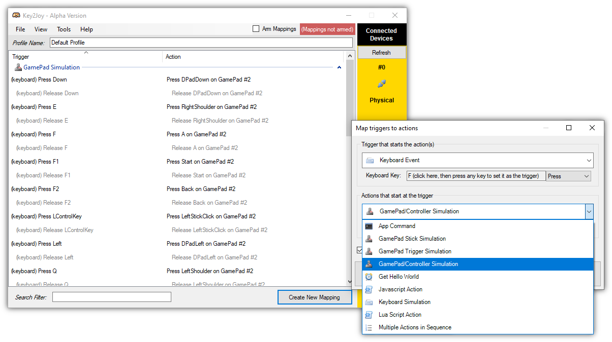

<div align="center">

# <br> Key2Joy

[](https://github.com/luttje/Key2Joy/actions/workflows/tests.yml)
[](https://coveralls.io/github/luttje/Key2Joy?branch=main)

</div>

**Simulate a Joystick/Controller/Gamepad using your keyboard, mouse or other triggers.**

In addition to simply simulating a button being pressed on the Joystick, you can also write Javascript and Lua scripts to execute a more complex sequence of actions.

---

## System Requirements

* Windows 8.1, Windows 10 or Windows 11
* [.NET Framework 4.8](https://dotnet.microsoft.com/en-us/download/dotnet-framework/net48), which has been included in Windows since `Windows 10 May 2019 Update (version 1903)`

## Installation

1. *(Optional)* I advise you [create a System Restore Point](https://support.microsoft.com/en-us/windows/create-a-system-restore-point-77e02e2a-3298-c869-9974-ef5658ea3be9)
2. Download a binary from the [releases of this repo](https://github.com/luttje/Key2Joy/releases)
3. Extract all files to the same location

## Usage

**⚠ Use at own risk!** Incorrect driver (un)installation may cause a blue screen.

### Using Key2Joy with a Graphical User Interface

1. Start ** Key2Joy.exe**
2. *(First time only)* Accept installation of the Scp Virtual Bus Driver
3. Use the default mappings, modify them by double-clicking a row in the mapping-list, or add new mappings.

   

   **A trigger** is something that Key2Joy will listen for. *E.g: a mouse move, key press, key release, etc...*
   > **⚠ Note:** The default behaviour of a trigger is disabled. This means setting the left mouse button as a trigger will make it so you can't left-click anymore until you abort this app.

   **An action** is what will happen when that trigger occurs. *E.g: simulating a joystick button being pressed, a keyboard button being released, or executing a Lua/Javascript script.*

4. Tick the *Enable* checkbox for Key2Joy to start listening for triggers that will execute the configured actions.

5. When you're done using Key2Joy, uncheck the *Enable* checkbox to stop listening for triggers.

   *In the default profile there is also a mapping that stops Key2Joy from listening using the `Escape`-key. Don't forget to include such a mapping for your custom profiles.*


### Using Key2Joy with a Command Line Interface

1. Run `Key2Joy.Cmd.exe enable` in a command-prompt:

   * This will start Key2Joy if it's not already running. *(Note: you need to have started the GUI app (Key2Joy.exe) at least once since installing)*
   * By default it will enable the last used profile
   * You can use `--profile default-profile` to specify which profile file to enable (you don't have to include the `.k2j.json` extension)

2. Running `Key2Joy.Cmd.exe disable` will disable the active profile


---

## Scripting

You can create scripts in Lua or Javascript that perform a sequence of actions with more complex logic.

Here is a simple example of a script that holds the "A" button on a gamepad for 500 ms and then stops simulating input:
```lua
Print("Hello World!")

GamePad.Simulate(GamePadControl.A, PressState.Press)
SetTimeout(function()
   GamePad.Simulate(GamePadControl.A, PressState.Release)
   App.Command("abort")
end, 500)
```

**You probably want to bind scripts only to the "Release" press state of triggers.** Otherwise a script will be executed both on key down AND up.

Full scripting reference is available in [Docs/Scripting.md](Docs/Scripting.md)

---

## Known Issues

- Windows wont let you click if you release a mouse key that hasn't been pressed before.
- Keyboard triggers do not activate when the app is in the foreground.

---

## Uninstalling

Use `ScpDriverInstaller.exe` to uninstall the driver. You can find the latest version here: [mogzol/ScpDriverInterface releases](https://github.com/mogzol/ScpDriverInterface/releases)

**⚠ Do not uninstall the driver through Device manager or you'll end up with an incomplete and corrupt driver installation.**

---

## Contributing

Please do not hesitate to [create an issue](/../../issues/new/) when you find a problem, or [submit a Pull Request](/../../pulls/) when you've made enhancements or fixed bugs.

*♥ Thanks in advance for your help!*

---

## Credits 😍

This exists only because of this awesome NuGet package ([DavidRieman/SimWinInput](https://github.com/DavidRieman/SimWinInput)) which allows simulation of gamepads from .NET.

Simulation is made possible through installation and usage of the [nefarius/ScpVBus](https://github.com/nefarius/ScpVBus) driver. 

Inspired by [JoyToKey](https://joytokey.net/en/) which does the inverse (simulate keyboard with gamepad).

Scripting in Lua and Javascript works thanks to [NLua](https://github.com/NLua/NLua) and [Jint](https://github.com/sebastienros/jint) respectively.

The action list in the GUI uses [ObjectListView](https://objectlistview.sourceforge.net).

Some [Silk Icons](https://github.com/legacy-icons/famfamfam-silk/blob/master/LICENSE.md) are used in the GUI.

---

## License

This software is license under [the MIT License (see LICENSE-file)](LICENSE). The licenses for other libraries and/or code used can be found in [the LICENSE-3RD-PARTY.txt file](LICENSE-3RD-PARTY.txt).