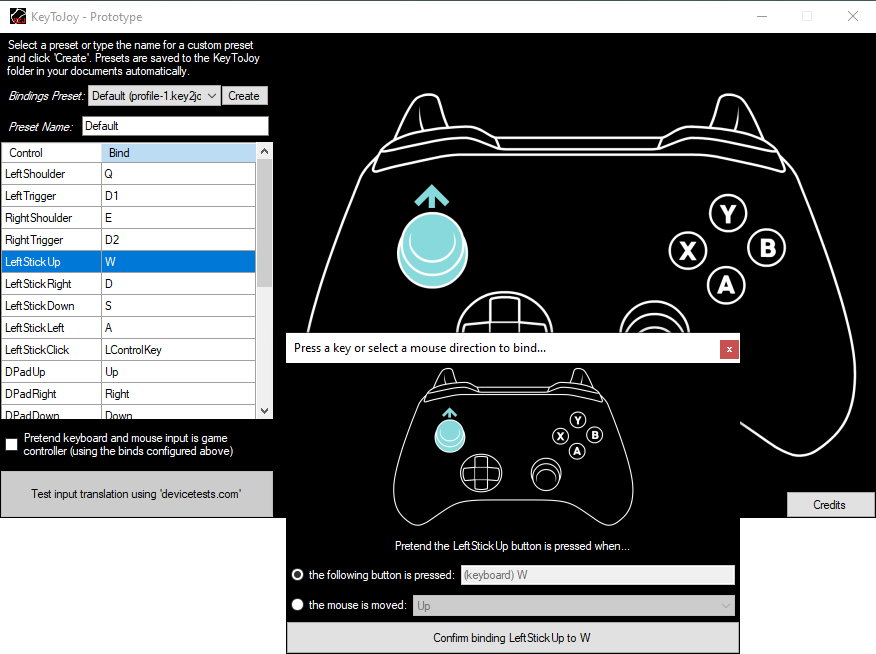

# KeyToJoy
Simulate a GameController/Joystick using your keyboard and mouse.

This is a quick prototype so I can play the game ['Aperture Desk
Job'](https://store.steampowered.com/app/1902490/Aperture_Desk_Job/)
without the use of a Steam Deck or controller.

## Usage

**⚠ Use at own risk!** Incorrect driver (un)installation may cause a blue
screen.

1. *(Optional)* I advise you [create a System Restore
   Point](https://support.microsoft.com/en-us/windows/create-a-system-restore-point-77e02e2a-3298-c869-9974-ef5658ea3be9)
2. Download a binary from the [releases of this
   repo](https://github.com/luttje/KeyToJoy/releases)
3. Extract all files to the same location
4. Start KeyToJoy.exe
5. Accept installation of the Scp Virtual Bus Driver
6. Tick the checkbox to simulate the game controller

## Uninstalling

Use `ScpDriverInstaller.exe` to uninstall the driver. You can find the
latest version here: [mogzol/ScpDriverInterface
releases](https://github.com/mogzol/ScpDriverInterface/releases)

**⚠ Do not uninstall the driver through Device manager or you'll end up
with an incomplete and corrupt driver installation.**

## Credits 😍

This exists only because of this awesome NuGet package
([DavidRieman/SimWinInput](https://github.com/DavidRieman/SimWinInput))
which allows simulation of gamepads from .NET.

Simulation is made possible through installation and usage of the
[nefarius/ScpVBus](https://github.com/nefarius/ScpVBus) driver. 

Inspired by [JoyToKey](https://joytokey.net/en/) which does the inverse
(simulate keyboard with gamepad).

## License

This software is license under [the MIT License (see
LICENSE-file)](LICENSE). The licenses for other libraries and/or code used
can be found in [the LICENSE-3RD-PARTY.txt file](LICENSE-3RD-PARTY.txt).